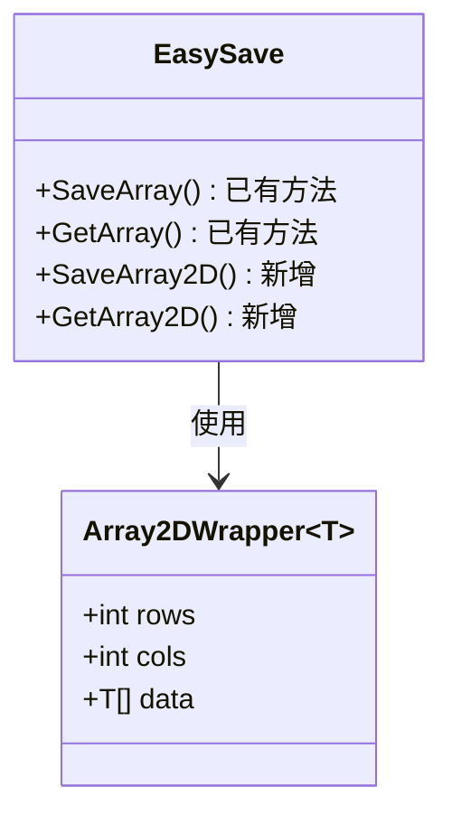
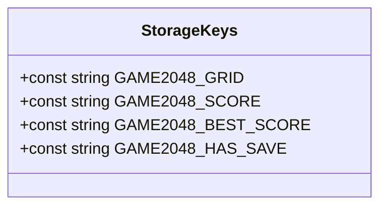
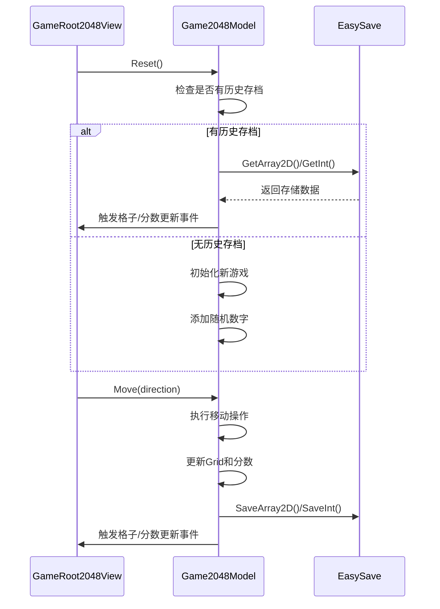

# 2048游戏数据本地存储实现方案

## 1. 需求概述

实现2048游戏数据的本地存储和加载功能，使得：
1. 游戏数据发生改变时将数据存入本地
2. 进入游戏时先检查是否有历史记录
3. 如果有历史记录则将游戏初始化为历史记录
4. 如果没有则正常开始游戏

## 2. 技术方案

### 2.1 扩展EasySave支持二维数组存储

在现有的EasySave类中添加对二维数组的支持，实现思路是创建一个包装类将二维数组转换为一维数组进行序列化。



#### 新增方法和类

1. **Array2DWrapper<T>类**：用于二维数组的序列化
   ```csharp
   [Serializable]
   private class Array2DWrapper<T>
   {
       public int rows;
       public int cols;
       public T[] data;
   }
   ```

2. **SaveArray2D<T>方法**：保存二维数组
   ```csharp
   public static void SaveArray2D<T>(string key, T[,] array)
   ```

3. **GetArray2D<T>方法**：获取二维数组
   ```csharp
   public static T[,] GetArray2D<T>(string key, T[,] defaultValue = null)
   ```

### 2.2 创建存储键名常量类

在GameDefine文件夹下创建一个新的常量类，用于统一管理存储键名。



#### 键名定义

```csharp
public static class StorageKeys
{
    public const string GAME2048_GRID = "Game2048_Grid";
    public const string GAME2048_SCORE = "Game2048_Score";
    public const string GAME2048_BEST_SCORE = "Game2048_BestScore";
    public const string GAME2048_HAS_SAVE = "Game2048_HasSave";
}
```

### 2.3 修改Game2048Model实现数据存储和加载

在Game2048Model类中添加保存和加载逻辑，包括：



#### 新增或修改的方法

1. **SaveGameData方法**：保存游戏数据
   ```csharp
   private void SaveGameData()
   {
       // 保存网格数据、分数和最高分
   }
   ```

2. **修改Reset方法**：添加检查并加载历史记录的逻辑
   ```csharp
   public void Reset()
   {
       // 检查是否有历史记录
       // 如果有则加载，无则正常初始化
   }
   ```

3. **修改Move方法**：在移动后保存游戏数据
   ```csharp
   public bool Move(Vector2Int direction)
   {
       // 原有逻辑
       ...
       
       // 添加保存数据的调用
       if (moved)
       {
           SaveGameData();
       }
       
       return moved;
   }
   ```

## 3. 具体实现步骤

### 3.1 扩展EasySave类
1. 添加Array2DWrapper私有类
2. 实现SaveArray2D方法
3. 实现GetArray2D方法

### 3.2 创建StorageKeys类
1. 在GameDefine文件夹下创建StorageKeys.cs
2. 定义所需的存储键名常量

### 3.3 修改Game2048Model类
1. 添加SaveGameData私有方法
2. 修改Reset方法检查并加载历史数据
3. 修改Move方法在数据变化时调用SaveGameData
4. 确保存储最高分数

### 3.4 测试验证
1. 确保移动操作后数据会被保存
2. 确保游戏重启后能够加载历史数据
3. 验证最高分记录是否正确保存和加载

## 4. 注意事项

1. **错误处理**：加载数据失败时应安全回退到新游戏初始化
2. **数据完整性**：保存时确保所有相关数据都被正确保存
3. **性能考虑**：可能需要考虑数据变化很频繁时的性能影响