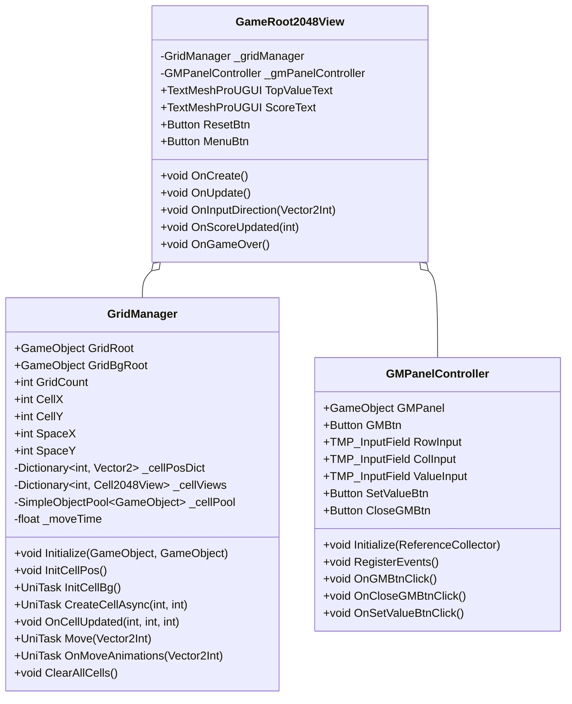

# 2048游戏视图层重构调整计划

根据反馈，我们将简化之前的重构方案，只拆分出两个核心类：
1. **GridManager** - 负责网格和格子的管理
2. **GMPanelController** - 负责调试面板功能

## 一、拆分设计

## 二、类职责划分

### 1. GridManager职责

**数据管理**
- 格子位置字典 (_cellPosDict)
- 格子视图字典 (_cellViews)
- 网格参数 (GridCount, CellX, CellY, SpaceX, SpaceY)

**功能**
- 初始化格子位置
- 创建背景格子
- 创建、更新和销毁格子
- 处理格子移动动画
- 管理格子对象池

### 2. GMPanelController职责

**UI元素**
- GM面板及其所有控件
- 输入字段和按钮

**功能**
- 初始化GM面板
- 处理GM面板的显示和隐藏
- 处理GM面板上的按钮事件
- 设置格子值的逻辑

### 3. GameRoot2048View保留的职责

**UI元素**
- 分数显示
- 重置和菜单按钮

**功能**
- 处理重置和菜单按钮事件
- 管理游戏整体生命周期
- 处理事件监听和分发
- 连接输入系统和模型系统

## 三、实现步骤

### 第一步：创建GridManager类

1. 创建GridManager.cs文件
2. 将GameRoot2048View中的网格和格子相关代码移动到GridManager
3. 修改GameRoot2048View，添加对GridManager的引用和初始化

### 第二步：创建GMPanelController类

1. 创建GMPanelController.cs文件
2. 将GameRoot2048View中的GM面板相关代码移动到GMPanelController
3. 修改GameRoot2048View，添加对GMPanelController的引用和初始化

### 第三步：修改GameRoot2048View

1. 移除已转移到其他类的代码
2. 添加对新创建类的引用和初始化逻辑
3. 确保事件正确传递给相应的组件

## 四、优势

1. **降低耦合度**：将不同功能的代码分离到不同的类中
2. **提高可维护性**：每个类的职责明确，便于理解和修改
3. **提高可扩展性**：便于添加新功能或修改现有功能
4. **代码组织更清晰**：避免单个文件过长，提高可读性

## 五、实施注意事项

1. **保持接口一致性**：确保拆分后的接口与原接口保持一致
2. **逐步实施**：先完成一个类的拆分，测试无误后再进行下一个
3. **确保事件系统正常工作**：检查事件的注册和触发逻辑是否正确
4. **维护对象生命周期**：确保对象的创建和销毁逻辑正确