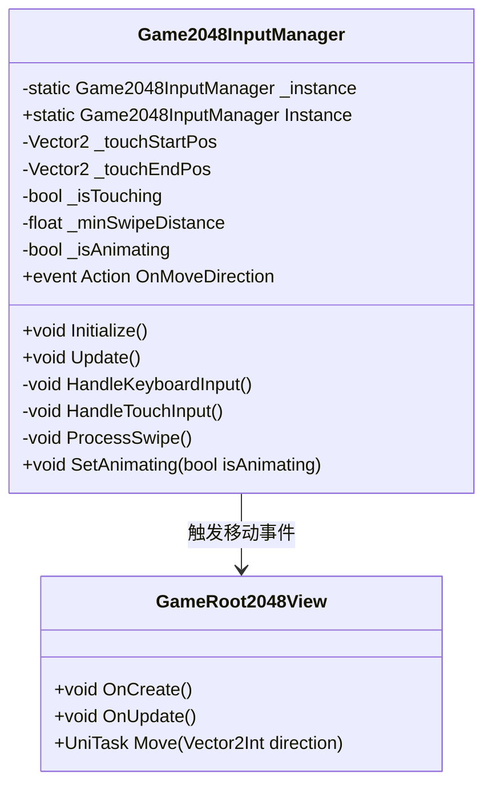
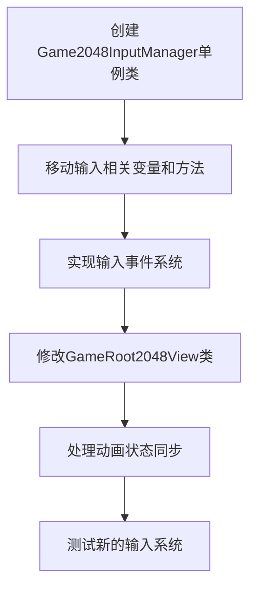

# 2048游戏代码重构计划：将输入逻辑提取为单例类

## 重构目标

将`GameRoot2048View.cs`文件中的输入处理逻辑分离出来，移动到一个独立的单例类中，以提高代码的模块化和可维护性。

## 分析当前代码

在`GameRoot2048View.cs`中，输入相关的逻辑包括：

1. **成员变量**（第45-49行）：
   - 滑动输入相关变量（_touchStartPos, _touchEndPos, _isTouching等）
   - 动画标志（_isAnimating）

2. **处理方法**：
   - OnUpdate（第157-173行）：根据平台选择对应的输入处理方法
   - HandleKeyboardInput（第175-197行）：键盘方向键输入处理
   - HandleTouchInput（第199-239行）：触摸和鼠标输入处理
   - ProcessSwipe（第241-280行）：滑动手势处理与方向判断
   - Move（第282-293行）：根据输入方向移动格子

## 重构计划

### 1. 创建新的输入管理器单例类

创建一个新的单例类`Game2048InputManager`，专门处理2048游戏的输入逻辑。



### 2. 定义输入事件和回调机制

使用事件系统实现`Game2048InputManager`与`GameRoot2048View`之间的通信：

```csharp
// 在Game2048InputManager中定义方向事件
public event Action<Vector2Int> OnMoveDirection;

// 触发方向事件
private void TriggerDirection(Vector2Int direction)
{
    OnMoveDirection?.Invoke(direction);
}
```

## 实现步骤详解

### 步骤1：创建Game2048InputManager.cs文件

在同一目录下创建新的输入管理器类文件，实现单例模式和基本功能：

```csharp
using System;
using UnityEngine;

namespace GameLogic
{
    public class Game2048InputManager
    {
        private static Game2048InputManager _instance;
        public static Game2048InputManager Instance
        {
            get
            {
                if (_instance == null)
                {
                    _instance = new Game2048InputManager();
                }
                return _instance;
            }
        }
        
        // 从GameRoot2048View移动过来的输入相关变量
        private Vector2 _touchStartPos;
        private Vector2 _touchEndPos;
        private bool _isTouching = false;
        private float _minSwipeDistance = 50f;
        
        // 动画标志
        private bool _isAnimating = false;
        
        // 移动方向事件
        public event Action<Vector2Int> OnMoveDirection;
        
        // 设置动画状态
        public void SetAnimating(bool isAnimating)
        {
            _isAnimating = isAnimating;
        }
        
        // 触发方向事件
        private void TriggerDirection(Vector2Int direction)
        {
            OnMoveDirection?.Invoke(direction);
        }
    }
}
```

### 步骤2：将输入处理方法移动到新类中

从`GameRoot2048View`中提取输入相关方法到`Game2048InputManager`：

```csharp
public void Update()
{
    // 在WebGL、移动平台或编辑器模式下都支持触摸输入
    if (Application.platform == RuntimePlatform.WebGLPlayer ||
        Application.platform == RuntimePlatform.Android ||
        Application.platform == RuntimePlatform.IPhonePlayer ||
        Application.isEditor)
    {
        HandleTouchInput();
    }

    if (Application.isEditor)
    {
        // 在编辑器模式下，支持键盘输入
        HandleKeyboardInput();
    }
}

private void HandleKeyboardInput()
{
    // 如果正在动画中，不处理输入
    if (_isAnimating)
        return;

    if (Input.GetKeyDown(KeyCode.UpArrow))
    {
        TriggerDirection(Vector2Int.up);
    }
    else if (Input.GetKeyDown(KeyCode.DownArrow))
    {
        TriggerDirection(Vector2Int.down);
    }
    else if (Input.GetKeyDown(KeyCode.LeftArrow))
    {
        TriggerDirection(Vector2Int.left);
    }
    else if (Input.GetKeyDown(KeyCode.RightArrow))
    {
        TriggerDirection(Vector2Int.right);
    }
}

private void HandleTouchInput()
{
    // 如果正在动画中，不处理输入
    if (_isAnimating)
        return;

    // 检测触摸开始
    if (Input.touchCount > 0)
    {
        Touch touch = Input.GetTouch(0);

        // 触摸开始
        if (touch.phase == TouchPhase.Began)
        {
            _touchStartPos = touch.position;
            _isTouching = true;
        }
        // 触摸结束
        else if (touch.phase == TouchPhase.Ended && _isTouching)
        {
            _touchEndPos = touch.position;
            ProcessSwipe();
            _isTouching = false;
        }
    }
    // 鼠标输入（用于WebGL和编辑器中测试）
    else
    {
        if (Input.GetMouseButtonDown(0))
        {
            _touchStartPos = Input.mousePosition;
            _isTouching = true;
        }
        else if (Input.GetMouseButtonUp(0) && _isTouching)
        {
            _touchEndPos = Input.mousePosition;
            ProcessSwipe();
            _isTouching = false;
        }
    }
}

private void ProcessSwipe()
{
    // 计算滑动方向和距离
    Vector2 swipeDelta = _touchEndPos - _touchStartPos;
    float swipeDistance = swipeDelta.magnitude;

    // 如果滑动距离太小，则忽略
    if (swipeDistance < _minSwipeDistance)
        return;

    // 确定主要的滑动方向
    if (Mathf.Abs(swipeDelta.x) > Mathf.Abs(swipeDelta.y))
    {
        // 水平滑动
        if (swipeDelta.x > 0)
        {
            // 向右滑动
            TriggerDirection(Vector2Int.right);
        }
        else
        {
            // 向左滑动
            TriggerDirection(Vector2Int.left);
        }
    }
    else
    {
        // 垂直滑动
        if (swipeDelta.y > 0)
        {
            // 向上滑动
            TriggerDirection(Vector2Int.up);
        }
        else
        {
            // 向下滑动
            TriggerDirection(Vector2Int.down);
        }
    }
}
```

### 步骤3：修改GameRoot2048View类

1. 移除已转移到`Game2048InputManager`的变量和方法
2. 在OnCreate中初始化输入管理器并注册事件
3. 简化OnUpdate方法，移除输入处理代码

对`GameRoot2048View.cs`文件的主要修改：

1. 移除输入相关变量（Vector2 _touchStartPos等）
2. 移除HandleKeyboardInput、HandleTouchInput和ProcessSwipe方法
3. 修改OnUpdate方法，不再包含输入处理逻辑
4. 在OnCreate中注册输入事件
5. 在OnDestroy中取消注册输入事件
6. 修改Move方法，同步动画状态

```csharp
protected override void OnCreate()
{
    InitCellPos();
    
    // 注册输入管理器的移动事件
    Game2048InputManager.Instance.OnMoveDirection += OnMoveDirection;
    
    OnCreateAsync().Forget();
}

// 新增的事件处理方法
private void OnMoveDirection(Vector2Int direction)
{
    Move(direction).Forget();
}

protected override void OnUpdate()
{
    // 该方法可以留空或调用输入管理器的Update
    Game2048InputManager.Instance.Update();
}

private async UniTask Move(Vector2Int source)
{
    // 设置动画标志为true，阻止新的移动
    Game2048InputManager.Instance.SetAnimating(true);
    
    await OnMoveAnimations(source);
    
    Game2048Model.Instance.Move(source);
    
    // 动画和移动处理结束后，设置动画标志为false，允许新的移动
    Game2048InputManager.Instance.SetAnimating(false);
}

protected override void OnDestroy()
{
    // 移除事件监听
    Game2048InputManager.Instance.OnMoveDirection -= OnMoveDirection;
    
    // 其他清理代码...
    base.OnDestroy();
}
```

## 实现流程



## 优势与注意事项

### 优势
1. **解耦合**：将输入逻辑从UI逻辑中分离，提高代码清晰度
2. **全局可访问**：单例模式使输入管理器在任何地方都可以被访问
3. **易于扩展**：未来可以轻松添加新的输入方式（如游戏手柄）

### 注意事项
1. **事件注册与取消**：确保在视图销毁时取消事件注册，避免内存泄漏
2. **状态同步**：保持输入管理器与游戏视图的状态同步，特别是动画标志
3. **性能考虑**：单例的Update方法应在游戏中的适当时机被调用