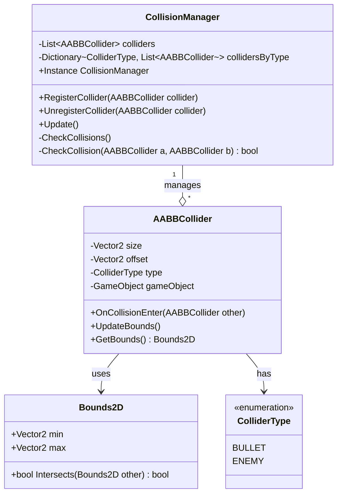

# AABB碰撞算法实现方案

## 系统概述

我们将设计一个独立于Unity物理系统的AABB（轴对齐包围盒）碰撞检测系统，主要用于2D场景中子弹和敌人之间的碰撞检测及响应。系统将采用单例模式进行管理，与您现有的代码结构相匹配。

## 核心组件设计



## 具体类设计

### 1. Bounds2D类

```csharp
// 2D边界框，用于AABB碰撞检测
public struct Bounds2D
{
    public Vector2 min;
    public Vector2 max;

    // 检测是否与另一个边界框相交
    public bool Intersects(Bounds2D other)
    {
        return !(other.max.x < min.x ||
                 other.min.x > max.x ||
                 other.max.y < min.y ||
                 other.min.y > max.y);
    }
}
```

### 2. ColliderType枚举

```csharp
// 碰撞体类型枚举
public enum ColliderType
{
    BULLET,
    ENEMY
}
```

### 3. AABBCollider类

```csharp
// AABB碰撞组件
public class AABBCollider : MonoBehaviour
{
    public Vector2 size = Vector2.one;  // 碰撞体大小
    public Vector2 offset = Vector2.zero;  // 碰撞体偏移量
    public ColliderType type;  // 碰撞体类型

    // 碰撞回调委托
    public System.Action<AABBCollider> onCollisionEnter;

    private void Start()
    {
        // 向碰撞管理器注册
        CollisionManager.Instance.RegisterCollider(this);
    }

    private void OnDestroy()
    {
        // 从碰撞管理器注销
        CollisionManager.Instance.UnregisterCollider(this);
    }

    // 获取当前碰撞体的边界框
    public Bounds2D GetBounds()
    {
        Vector2 position = (Vector2)transform.position + offset;
        Vector2 halfSize = size / 2;

        return new Bounds2D
        {
            min = position - halfSize,
            max = position + halfSize
        };
    }
}
```

### 4. CollisionManager类

```csharp
// 碰撞管理器，采用单例模式
public class CollisionManager : SingletonBehaviour<CollisionManager>
{
    // 所有碰撞体列表
    private List<AABBCollider> colliders = new List<AABBCollider>();

    // 按类型分组的碰撞体字典，用于优化碰撞检测
    private Dictionary<ColliderType, List<AABBCollider>> collidersByType =
        new Dictionary<ColliderType, List<AABBCollider>>();

    // 注册碰撞体
    public void RegisterCollider(AABBCollider collider)
    {
        colliders.Add(collider);

        // 按类型分组
        if (!collidersByType.ContainsKey(collider.type))
        {
            collidersByType[collider.type] = new List<AABBCollider>();
        }
        collidersByType[collider.type].Add(collider);
    }

    // 注销碰撞体
    public void UnregisterCollider(AABBCollider collider)
    {
        colliders.Remove(collider);

        if (collidersByType.ContainsKey(collider.type))
        {
            collidersByType[collider.type].Remove(collider);
        }
    }

    // 每帧更新，执行碰撞检测
    private void Update()
    {
        CheckCollisions();
    }

    // 检测所有碰撞
    private void CheckCollisions()
    {
        // 只检测子弹与敌人之间的碰撞
        if (!collidersByType.ContainsKey(ColliderType.BULLET) ||
            !collidersByType.ContainsKey(ColliderType.ENEMY))
            return;

        var bullets = collidersByType[ColliderType.BULLET];
        var enemies = collidersByType[ColliderType.ENEMY];

        // 检测每个子弹与每个敌人之间的碰撞
        foreach (var bullet in bullets)
        {
            foreach (var enemy in enemies)
            {
                if (CheckCollision(bullet, enemy))
                {
                    // 调用碰撞回调
                    bullet.onCollisionEnter?.Invoke(enemy);
                    enemy.onCollisionEnter?.Invoke(bullet);
                }
            }
        }
    }

    // 检测两个碰撞体之间是否碰撞
    private bool CheckCollision(AABBCollider a, AABBCollider b)
    {
        return a.GetBounds().Intersects(b.GetBounds());
    }
}
```

## 实现流程

1. **创建基础结构**：
   - 首先实现Bounds2D结构和ColliderType枚举
   - 实现AABBCollider组件
   - 实现CollisionManager单例

2. **集成到游戏对象**：
   - 将AABBCollider组件添加到子弹和敌人对象上
   - 配置适当的大小、偏移和类型
   - 实现碰撞回调函数

3. **性能优化**：
   - 使用类型过滤减少不必要的碰撞检测
   - 可选：实现空间分割（如四叉树）以进一步优化大量对象的碰撞检测

4. **测试与调试**：
   - 实现可视化调试工具，显示碰撞边界
   - 测试各种碰撞场景

## 使用示例

```csharp
// 子弹类
public class Bullet : MonoBehaviour
{
    private AABBCollider collider;

    private void Awake()
    {
        collider = gameObject.AddComponent<AABBCollider>();
        collider.type = ColliderType.BULLET;
        collider.size = new Vector2(0.5f, 0.5f);
        collider.onCollisionEnter += OnCollision;
    }

    private void OnCollision(AABBCollider other)
    {
        // 子弹碰到敌人时的处理
        Debug.Log("子弹击中敌人");

        // 回收子弹对象到对象池
        PoolManager.Instance.PushGameObject(gameObject);
    }
}

// 敌人类
public class Enemy : MonoBehaviour
{
    private AABBCollider collider;
    private int health = 100;

    private void Awake()
    {
        collider = gameObject.AddComponent<AABBCollider>();
        collider.type = ColliderType.ENEMY;
        collider.size = new Vector2(1f, 1f);
        collider.onCollisionEnter += OnCollision;
    }

    private void OnCollision(AABBCollider other)
    {
        if (other.type == ColliderType.BULLET)
        {
            // 被子弹击中时的处理
            health -= 10;

            if (health <= 0)
            {
                // 敌人死亡
                Destroy(gameObject);
            }
        }
    }
}
