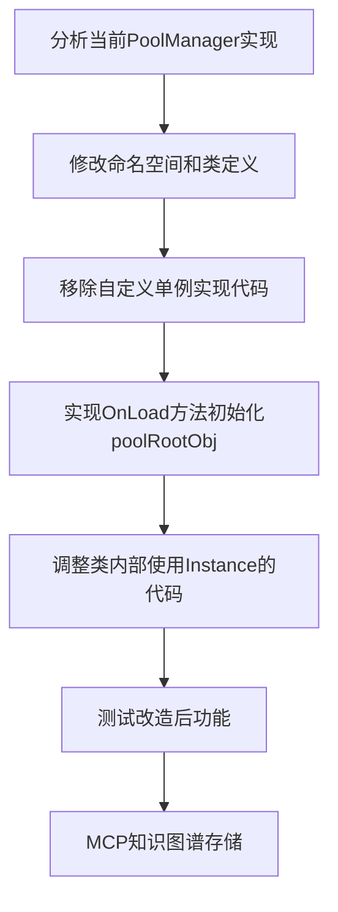

# PoolManager 单例模式改造计划

## 总体目标

将 `PoolManager` 从自定义单例模式改造为使用项目标准的 `SingletonBehaviour<T>` 单例基类实现。

## 改造步骤流程图



## 详细改造步骤

### 1. 修改命名空间和类定义

- 在PoolManager.cs中添加`using GameBase;`引用
- 将类定义修改为继承SingletonBehaviour<PoolManager>
- 保留GameLogic命名空间，确保外部引用不受影响

### 2. 移除自定义单例实现代码

- 删除私有静态字段`private static PoolManager _instance;`
- 删除自定义的`public static PoolManager Instance { get {...} }`属性
- 删除`DontDestroyOnLoad(_instance);`代码，因为这已在SingletonBehaviour中处理

### 3. 实现OnLoad方法初始化poolRootObj

- 添加对OnLoad方法的重写
- 在OnLoad方法中初始化poolRootObj = gameObject

### 4. 调整类内部使用Instance的代码

- 检查类内部是否有使用自身Instance的代码，如有则调整

### 5. 测试改造后功能

- 确保所有对象池功能正常工作
- 测试单例实例化和访问
- 验证DontDestroyOnLoad功能

### 6. 通过MCP存储知识

- 将单例模式重构的知识和经验存入知识图谱

## 代码修改对比

### 修改前

```csharp
using System;
using System.Collections.Generic;
using TEngine;
using UnityEngine;

namespace GameLogic
{
    public class PoolManager : MonoBehaviour
    {
        private static PoolManager _instance;

        public static PoolManager Instance
        {
            get
            {
                if (_instance == null)
                {
                    _instance = FindObjectOfType<PoolManager>();
                }

                if (_instance == null)
                {
                    GameObject gameObject = new GameObject();
                    gameObject.name = nameof(PoolManager);
                    _instance = gameObject.AddComponent<PoolManager>();
                    _instance.poolRootObj = gameObject;
                    DontDestroyOnLoad(_instance);
                }

                return _instance;
            }
        }

        [SerializeField] private GameObject poolRootObj;
        // 其他代码...
    }
}
```

### 修改后

```csharp
using System;
using System.Collections.Generic;
using TEngine;
using UnityEngine;
using GameBase; // 添加引用

namespace GameLogic
{
    public class PoolManager : SingletonBehaviour<PoolManager>
    {
        [SerializeField] private GameObject poolRootObj;
        
        // 重写OnLoad方法
        protected override void OnLoad()
        {
            base.OnLoad();
            poolRootObj = gameObject;
        }
        
        // 其他代码保持不变...
    }
}
```

## 预期收益

1. **代码统一性**：使用项目标准的单例实现
2. **可维护性**：减少重复代码，集中管理单例生命周期
3. **功能完善**：利用SingletonSystem提供的功能