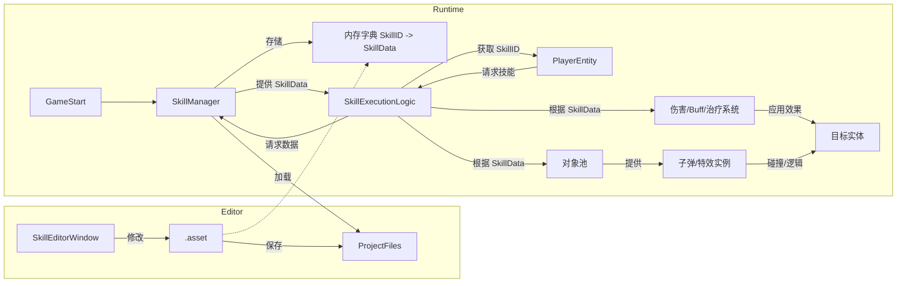

# Unity 技能编辑器开发计划

**目标:** 创建一个 Unity 编辑器窗口，用于配置技能数据，并将数据存储为 ScriptableObject (`.asset`) 文件，以便运行时加载和使用。

**核心需求:**
*   **编辑器界面:** 使用 `EditorWindow` 提供集成的编辑体验。
*   **数据存储:** 使用 `ScriptableObject` (`.asset` 文件) 存储每个技能的配置。
*   **技能属性:** 包含 ID, 名称, 类型, 目标, 释放方式, 索敌类型, 消耗, 冷却, 效果参数, 关联资源等。
*   **运行时加载:** 提供一个管理器 (`SkillManager`) 在运行时加载和查询技能数据。

**详细步骤:**

**1. 定义技能数据结构 (SkillData.cs)**

*   **位置:** `Assets/GameScripts/HotFix/GameLogic/DataConfigs/SkillData.cs`
*   **继承:** `UnityEngine.ScriptableObject`
*   **属性:**
    *   **枚举:** `SkillType`, `TargetType`, `CastType`, `TargetingType`, `TargetFaction`
    *   **字段:**
        *   基础信息: `SkillID`, `SkillName`, `Description`, `Icon`
        *   类型与目标: `Type`, `Target`, `Faction`, `Targeting`
        *   施放与消耗: `Cast`, `Cooldown`, `ManaCost`, `CastTime`
        *   效果参数: `Range`, `EffectRadius`, `EffectAngle`, `Duration`, `EffectValue`, `TickRate`, `MaxTargets`
        *   关联资源: `AssociatedPrefab`, `HitEffectPrefabName`, `CastSoundName`, `HitSoundName`
        *   其他: `Interruptible`, `RequiresLineOfSight`
*   **特性:** `[CreateAssetMenu(fileName = "NewSkillData", menuName = "Game Data/Skill Data")]`

**2. 创建技能编辑器窗口 (SkillEditorWindow.cs)**

*   **位置:** `Assets/Editor/SkillEditorWindow.cs`
*   **继承:** `UnityEditor.EditorWindow`
*   **功能:**
    *   **菜单入口:** `[MenuItem("Tools/技能编辑器")]`
    *   **布局:**
        *   左侧面板: 显示技能列表 (可滚动)，提供 "创建新技能" 和 "刷新列表" 按钮。
        *   右侧面板: 显示选中技能的详细信息 (可滚动)，提供 "保存更改" 和 "删除此技能" 按钮。
    *   **数据加载:** `OnEnable` 时从指定路径 (`_skillDataPath`) 加载所有 `SkillData` 资源。
    *   **编辑:** 使用 `SerializedObject` 和 `SerializedProperty` 绘制属性字段，支持撤销/重做，修改后标记资源为 Dirty。
    *   **创建:** 创建新的 `SkillData` 实例，分配唯一 ID，保存为 `.asset` 文件，并刷新列表。
    *   **删除:** 删除选中的 `.asset` 文件，并刷新列表。
    *   **保存:** 手动点击 "保存更改" 时调用 `AssetDatabase.SaveAssets()`。

**3. 运行时加载与管理 (SkillManager.cs)**

*   **位置:** `Assets/GameScripts/HotFix/GameLogic/Managers/SkillManager.cs`
*   **设计:** 单例模式或 TEngine Module。
*   **功能:**
    *   **初始化:** 在游戏启动时加载所有 `SkillData` 资源。
        *   **注意:** 需要根据项目实际资源管理方案 (Resources, Addressables, AssetBundles) 实现运行时加载逻辑。编辑器下可暂时使用 `AssetDatabase` 加载。
    *   **存储:** 使用 `Dictionary<int, SkillData>` 存储加载的技能数据。
    *   **查询:** 提供 `GetSkillData(int skillID)` 方法供其他系统查询。
    *   **错误处理:** 处理重复 ID 和未找到 ID 的情况。

**4. 集成到游戏逻辑**

*   **获取管理器:** 在需要施放技能的逻辑中 (如 `PlayerAttackState`) 获取 `SkillManager` 实例。
*   **获取数据:** 根据当前技能 ID 调用 `SkillManager.GetSkillData()`。
*   **执行逻辑:**
    *   根据 `SkillData` 检查消耗、冷却。
    *   处理施法时间。
    *   执行索敌逻辑。
    *   使用 `PoolManager` 加载关联的 Prefab。
    *   应用技能效果 (伤害、Buff 等)。

**Mermaid 图 (数据流与组件交互):**

**下一步:** 切换到 `code` 模式开始实施此计划。
