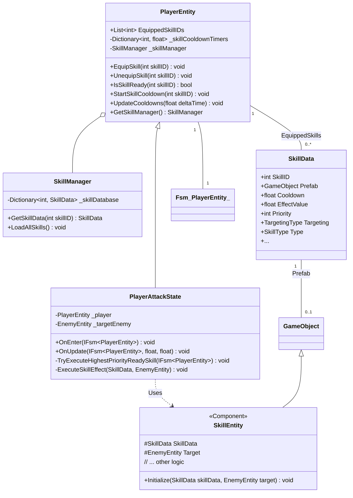

# 技能系统整合计划

## 1. 目标

将现有玩家攻击逻辑与技能系统深度整合，实现以下功能：

*   玩家可以装备一个技能列表（技能组），并在游戏中动态修改。
*   引入技能优先级机制，用于在多个技能可用时决定释放哪个技能。
*   每个技能拥有独立的冷却时间，由玩家实体管理。
*   攻击逻辑完全由技能数据驱动，包括效果、冷却、预制体等。
*   重构技能效果实体，使用更通用的命名。

## 2. 核心变更

*   **`PlayerEntity`**:
    *   管理一个可变的 `List<int> EquippedSkillIDs`。
    *   管理一个 `Dictionary<int, float> _skillCooldownTimers` 跟踪各技能独立冷却。
    *   提供装备/卸载技能的方法。
    *   负责更新技能冷却。
*   **`SkillData`**:
    *   新增 `public int Priority = 0;` 字段（建议数值越小优先级越高）。
*   **`PlayerAttackState`**:
    *   在进入状态时，查找 `EquippedSkillIDs` 中冷却完成且优先级最高的技能。
    *   执行选定技能的效果。
    *   触发选定技能的冷却。
    *   执行完技能或无可用技能时，切换回 `PlayerIdleState`。
*   **`SkillManager`**:
    *   职责保持不变，仅负责加载和提供 `SkillData`。
*   **`Bullet.cs` -> `SkillEntity.cs`**:
    *   重命名文件和类，使其能代表更通用的技能效果实体。
    *   修改初始化逻辑以接收 `SkillData`。

## 3. 详细实施步骤

1.  **修改 `SkillData.cs`:**
    *   在 `SkillData` 类中添加 `public int Priority = 0;` 字段，并添加相应的 `[Tooltip("技能释放优先级，数值越小优先级越高")]`。

2.  **修改 `PlayerEntity.cs`:**
    *   移除 `CurrentSkillID` 字段。
    *   添加 `public List<int> EquippedSkillIDs { get; private set; } = new List<int>();`。
    *   添加 `private Dictionary<int, float> _skillCooldownTimers = new Dictionary<int, float>();`。
    *   添加运行时修改技能组的方法：`public void EquipSkill(int skillID)` 和 `public void UnequipSkill(int skillID)`。确保这些方法会同步更新 `_skillCooldownTimers`。
    *   添加 `public void UpdateCooldowns(float deltaTime)` 方法，在 `PlayerEntity` 的 `Update` 中调用，遍历 `_skillCooldownTimers` 并减少计时（`timer -= deltaTime`）。
    *   修改 `public bool IsSkillReady(int skillID)` 方法，检查 `_skillCooldownTimers.TryGetValue(skillID, out float timer) && timer <= 0f`。
    *   修改 `public void StartSkillCooldown(int skillID)` 方法：获取 `SkillData`，如果存在且 `_skillCooldownTimers` 包含该ID，则设置 `_skillCooldownTimers[skillID] = skillData.Cooldown;`。
    *   确保 `GetSkillManager()` 能正确获取 `SkillManager` 实例（例如，在 `Awake` 中 `_skillManager = GameModule.GetModule<SkillManager>();`）。
    *   移除旧的 `Attack(EnemyEntity enemy)` 方法。

3.  **重命名和修改 `Bullet.cs` -> `SkillEntity.cs`:**
    *   **重命名文件:** 将 `Assets/GameScripts/HotFix/GameLogic/GameView/Game/Bullet.cs` 重命名为 `Assets/GameScripts/HotFix/GameLogic/GameView/Game/SkillEntity.cs`。
    *   **修改类名:** 将文件内的 `public class Bullet : MonoBehaviour` 修改为 `public class SkillEntity : MonoBehaviour`。
    *   **修改初始化方法:** 将 `Init(Transform target, int damage)` 修改为 `public virtual void Initialize(SkillData skillData, EnemyEntity target)`。添加 `protected SkillData SkillData;` 和 `protected EnemyEntity Target;` 字段来存储传入的数据。
    *   **更新内部逻辑:** 修改 `SkillEntity` 的移动、碰撞、伤害计算等逻辑，使其依赖于 `this.SkillData` 中的属性（如 `EffectValue`, `Range`, `EffectRadius` 等）。确保在效果完成或超时后正确调用 `PoolManager.Instance.ReleaseGameObjectAsync(gameObject)`。

4.  **修改 `PlayerAttackState.cs`:**
    *   移除 `_currentSkill` 字段。
    *   修改 `OnEnter`: 调用 `TryExecuteHighestPriorityReadySkill(fsm)`。
    *   修改 `OnUpdate`: 移除所有逻辑，因为状态切换由 `OnEnter` 中的 `TryExecuteHighestPriorityReadySkill` 处理。
    *   移除 `PerformAttack()` 方法。
    *   创建新方法 `private void TryExecuteHighestPriorityReadySkill(IFsm<PlayerEntity> fsm)`:
        *   获取目标 `_targetEnemy` 并检查有效性。
        *   获取 `_player.EquippedSkillIDs`。
        *   创建一个 `List<SkillData> readySkills = new List<SkillData>();`。
        *   遍历 `EquippedSkillIDs`，如果 `_player.IsSkillReady(id)` 为 `true`，则获取 `SkillData data = _player.GetSkillManager().GetSkillData(id)`，若 `data` 不为空则添加到 `readySkills`。
        *   如果 `readySkills.Count == 0` 或目标无效，则 `ChangeState<PlayerIdleState>(fsm); return;`。
        *   对 `readySkills` 进行排序：`readySkills.Sort((a, b) => a.Priority.CompareTo(b.Priority));`。
        *   获取最高优先级技能：`SkillData skillToExecute = readySkills[0];`。
        *   调用 `ExecuteSkillEffect(skillToExecute, _targetEnemy)`。
        *   调用 `_player.StartSkillCooldown(skillToExecute.SkillID)`。
        *   `ChangeState<PlayerIdleState>(fsm);`。
    *   修改 `private async void ExecuteSkillEffect(SkillData skillData, EnemyEntity target)`:
        *   检查 `skillData.Prefab`。
        *   如果 `skillData.Prefab != null`：
            *   `var effectObject = await PoolManager.Instance.GetGameObjectAsync(skillData.Prefab.name, _player.transform.parent);` (确保Prefab名称或路径正确)。
            *   `effectObject.transform.position = _player.transform.position;` (或根据技能调整起始位置)。
            *   `var skillEntity = effectObject.GetOrAddComponent<SkillEntity>();`
            *   `skillEntity.Initialize(skillData, target);`
        *   如果 `skillData.Prefab == null` (例如直接伤害或Buff):
            *   根据 `skillData.Type` 或其他标识，直接应用效果。例如：`target?.TakeDamage((int)skillData.EffectValue);` (注意判空)。

5.  **修改 `SkillManager.cs`:**
    *   保持不变。

6.  **修改 `SkillEditorWindow.cs`:**
    *   在 `DrawSkillDetailPanel` 的属性迭代逻辑中，确保新增的 `Priority` 字段能够被正确显示和编辑。

## 4. Mermaid 图示

### 类图



### 序列图 (简化攻击流程)

```mermaid
sequenceDiagram
    participant IdleState as PlayerIdleState
    participant AttackState as PlayerAttackState
    participant Player as PlayerEntity
    participant SkillMgr as SkillManager
    participant PoolMgr as PoolManager
    participant SkillEnt as SkillEntity

    IdleState ->> AttackState : ChangeState(TargetEnemy)
    activate AttackState
    AttackState ->> Player : Get EquippedSkillIDs
    AttackState ->> Player : Filter Ready Skills (using IsSkillReady)
    activate Player
    Player -->> AttackState : List~int~ readySkillIDs
    deactivate Player
    alt Ready Skills Found
        AttackState ->> SkillMgr : GetSkillData for Ready Skills
        activate SkillMgr
        SkillMgr -->> AttackState : List~SkillData~ readySkillDataList
        deactivate SkillMgr
        AttackState ->> AttackState : Sort readySkillDataList by Priority
        AttackState ->> AttackState : Select highestPrioritySkillData
        AttackState ->> AttackState : ExecuteSkillEffect(highestPrioritySkillData, target)
        activate AttackState
        opt Has Prefab
            AttackState ->> PoolMgr : GetGameObjectAsync(prefabName)
            activate PoolMgr
            PoolMgr -->> AttackState : effectObject
            deactivate PoolMgr
            AttackState ->> SkillEnt : Initialize(highestPrioritySkillData, target)
            activate SkillEnt
            SkillEnt -->> AttackState
            deactivate SkillEnt
        else No Prefab
            AttackState ->> Player : ApplyDirectEffect(highestPrioritySkillData, target)
        end
        deactivate AttackState
        AttackState ->> Player : StartSkillCooldown(highestPrioritySkillData.SkillID)
        activate Player
        Player -->> AttackState
        deactivate Player
        AttackState ->> IdleState : ChangeState()
        deactivate AttackState
    else No Ready Skills
        AttackState ->> IdleState : ChangeState()
        deactivate AttackState
    end

```

## 5. 后续步骤

*   代码模式实现上述修改。
*   测试技能装备/卸载功能。
*   测试不同优先级技能的选择逻辑。
*   测试技能冷却计时。
*   测试不同技能效果（带预制体和不带预制体）。
